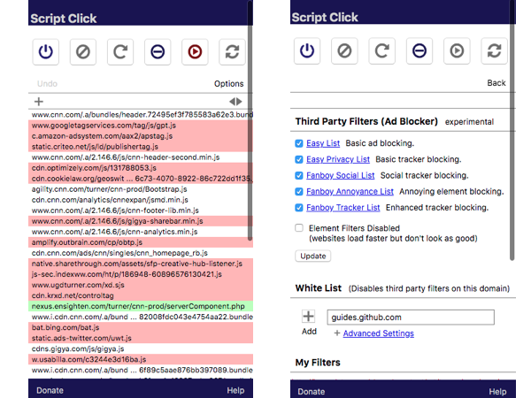

# ScriptClick

A chrome extension that lets you easily block annoying scripts on any website. You can block a single script, whole blocks, and even all scripts that cause ads. The extension scans every script against a local list of blocked addresses as well as as a list of blocked ads without significantly slowing down your browser. In fact with the ad blocker enabled pages normally load many times faster. This extension also has the ability to block some autoplay videos from playing on domains you specify.

The script can be viewed and downloaded from the [Google's Web Store](https://chrome.google.com/webstore/detail/script-click/eocpambiehlnlcelcmciakdpgkfhkpoh).

